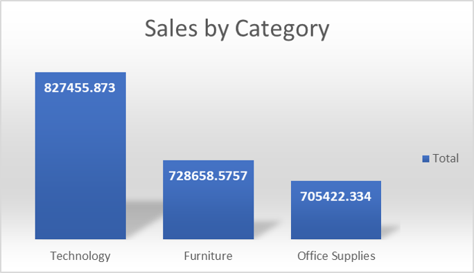
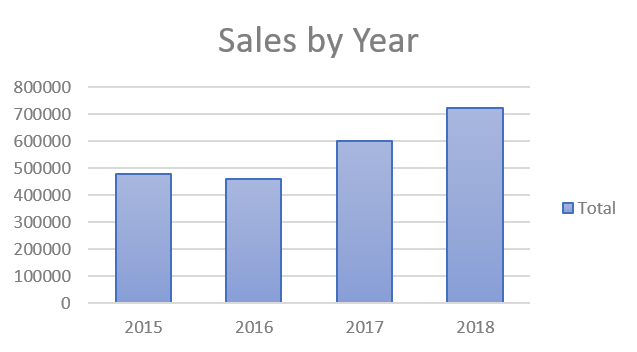
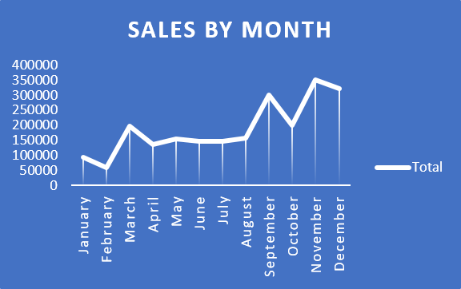

# Superstore Sales Analysis

**Project overview**  
This project analyzes sales data from the Superstore dataset to identify trends, top-performing categories, customer segments, and seasonal patterns.  
The purpose is to provide actionable recommendations for inventory, marketing, and sales strategies.

---

## Tools used
- Microsoft Excel (PivotTables, charts, data cleaning)  

---

## Files in this repository
- `data/superstore_cleaned.xlsx` — cleaned dataset used for analysis  
- `reports/Superstore_Case_Study.pdf` — complete case study with charts and commentary  
- `images/` — chart images used in the report  

---

## Key findings (summary)
- Technology is the top-selling category (~$827,456).  
- The Consumer segment drives the most revenue (~$1,148,061).  
- Sales grew year-over-year from 2016 to 2018, with notable peaks in November and December.  
- West and East regions lead in sales, while the South underperforms.  

---

## Visuals
### Sales by Category

### Sales by Region

### Sales by Year

### Monthly Sales

---

## How to view
- Open `reports/Superstore_Case_Study.pdf` for the full visuals and analysis.  
- Charts are also available in the `images/` folder.  

---

## Author
Ngene Christian — Aspiring Data Analyst  

---

## License
MIT License — see LICENSE file.
